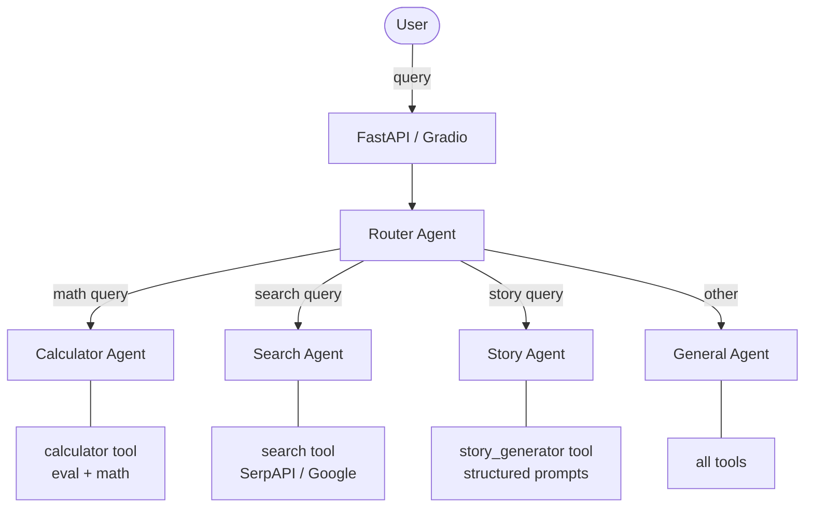

# Web Search Agent


A multi-agent system built with LangChain and OpenAI that intelligently routes user queries to specialized agents. A router agent analyzes each request and delegates it to the best-fit agent -- calculator, web search, story generator, or a general-purpose fallback.

## Features

- **Intelligent routing** -- an LLM-based router agent classifies queries and dispatches them to the right specialist
- **Web search** -- queries Google via SerpAPI and returns formatted results with sources
- **Calculator** -- evaluates mathematical expressions including trig functions, exponents, and constants
- **Story generator** -- produces structured story concepts (title, characters, page count, summary) from user-provided elements
- **General fallback** -- handles queries that don't fit a specific specialist, with access to all tools
- **Conversation memory** -- retains chat history within a session via `ConversationBufferMemory`
- **Dual interfaces** -- REST API (FastAPI) and browser UI (Gradio)
- **LangSmith integration** -- optional tracing and observability

## Architecture



## Tech Stack

| Dependency | Purpose |
|---|---|
| `langchain` / `langchain-openai` | Agent framework and OpenAI integration |
| `fastapi` / `uvicorn` | REST API server |
| `gradio` | Browser-based chat UI |
| `serpapi` | Web search via Google |
| `langsmith` | Tracing and observability |
| `pydantic` | Request/response validation |
| `python-dotenv` | Environment variable loading |

## Getting Started

### Prerequisites

- Python 3.10+
- [Poetry](https://python-poetry.org/docs/#installation)
- API keys (see below)

### Installation

```bash
git clone https://github.com/your-username/Web-Search-Agent.git
cd Web-Search-Agent
poetry install
```

### Environment Variables

Create a `.env` file in the project root:

```env
OPENAI_API_KEY=your-openai-api-key
API_KEY=your-serpapi-key

# Optional -- LangSmith tracing
LANGCHAIN_API_KEY=your-langchain-api-key
LANGCHAIN_TRACING_V2=true
LANGCHAIN_PROJECT=your-project-name
```

### Running

**FastAPI server** (default port 8000):

```bash
poetry run uvicorn src.main:app --reload
```

**Gradio UI** (default port 7860):

```bash
poetry run python gradio_app.py
```

## API Reference

### `POST /api/agent`

Send a natural-language query. The router selects the appropriate agent automatically.

**Request:**

```json
{
  "query": "What is 125 * 48?"
}
```

**Response:**

```json
{
  "answer": "125 * 48 = 6000",
  "steps": [
    "calculator: {'expression': '125 * 48'}"
  ]
}
```

### `GET /health`

Returns `{"status": "ok"}` when the server is running.

## Project Structure

```
src/
  main.py                  # FastAPI app, agent bootstrap
  logging_config.py        # Logging setup
  agents/
    base_agent.py          # Abstract base for all specialist agents
    router_agent.py        # LLM-based query router
    calculator_agent.py    # Math specialist
    search_agent.py        # Web search specialist
    story_agent.py         # Story generation specialist
    general_agent.py       # Fallback agent (all tools)
  tools/
    tool_registry.py       # Collects and exposes all tools
    calculator_tool.py     # eval()-based math evaluator
    search_tool.py         # SerpAPI Google search
    story_tool.py          # Story element generator
  services/
    agent_service.py       # MultiAgentService orchestration layer
    langsmith_service.py   # LangSmith initialization
  schemas/
    agent_schema.py        # Pydantic request/response models
  routers/
    agent_router.py        # FastAPI route definitions
  memory/                  # Memory module (placeholder)
  templates/               # Prompt templates (placeholder)
gradio_app.py              # Gradio browser UI
```

## Extending -- Adding a New Agent and Tool

1. **Create a tool** in `src/tools/` extending `BaseTool`. Define `name`, `description`, `_run`, and `_arun`.
2. **Register the tool** in `src/tools/tool_registry.py` so it appears in `get_all_tools()`.
3. **Create an agent** in `src/agents/` extending `BaseAgent`. Pass your tool and a system prompt to the parent constructor.
4. **Map the tool to the agent** in `src/services/agent_service.py` by adding an entry to `tool_agent_map`.

The router agent discovers tools automatically from the registry, so no routing changes are needed.

## Known Limitations and Roadmap

| Area | Status |
|---|---|
| Calculator uses `eval()` | Restricted namespace, but consider replacing with `sympy` or `numexpr` for production |
| No session management | Memory resets per process restart; no per-user sessions |
| No test suite | `pytest` is a dev dependency but no tests exist yet |
| Unbounded memory | `ConversationBufferMemory` grows without limit; consider `ConversationSummaryMemory` or windowed variants |
| Hardcoded model | `gpt-4o` is set in code; could be made configurable via env var |

## Contributing

1. Fork the repository
2. Create a feature branch (`git checkout -b feature/my-feature`)
3. Commit your changes
4. Push to the branch and open a Pull Request

Please ensure your code follows the existing project style and includes appropriate logging.

## License

This project is licensed under the MIT License.

---

> **Nota:** La documentacion de la interfaz Gradio esta disponible en espanol en [README_GRADIO.md](README_GRADIO.md).
